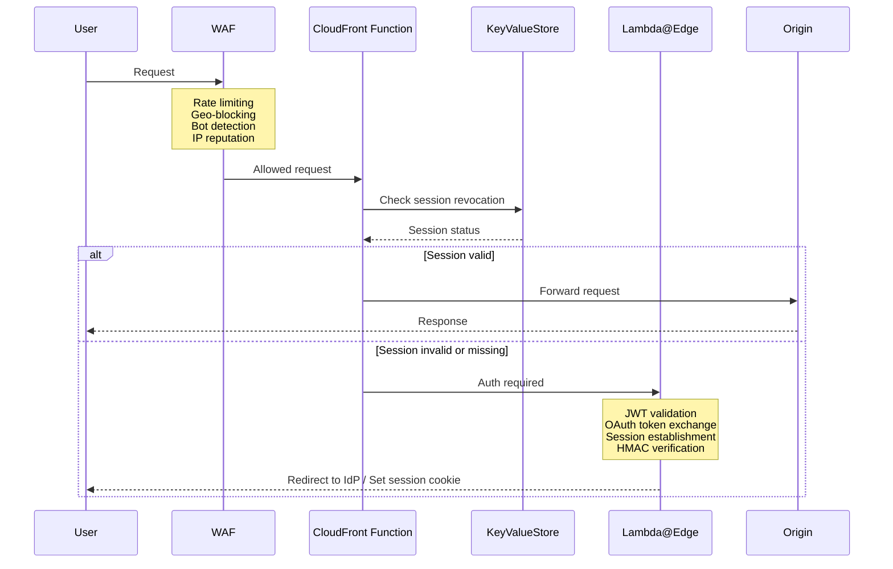

# The CDN Is Already a Zero Trust Gateway

Many organisations are buying, evaluating, or already paying for zero trust network access (ZTNA) overlay products. These are tools that sit in front of your workloads, verify identity, enforce policy, and only then allow traffic through.

I've implemented them into several environments, and it made me think about what they're really doing at the fundamental layer.

Here's the thing — if you're running web applications behind a CDN, you already have that enforcement point.

## What Zero Trust Actually Means at the Edge

Zero trust, stripped of the marketing, means: don't trust the network. Verify every request. Enforce policy as close to the requester as possible.

A CDN edge node is, by definition, the closest compute to the requester. Every major CDN provider now offers programmable compute at the edge — AWS CloudFront has CloudFront Functions and Lambda@Edge, Cloudflare has Workers, Azure has Azure Front Door with Rules Engine and Azure Functions integration.

That means you can verify identity, validate tokens, check session state, and enforce access policy *before a single byte reaches your origin infrastructure*. Not at the load balancer. Not at the API gateway. At the edge, milliseconds from the user.

That's zero trust enforcement. It's included in the price of your CDN.

## The Architecture

Let me walk through what this looks like on AWS CloudFront, since that's where I've built a working implementation. The same principles apply to Cloudflare and Azure Front Door.

The architecture uses layers, each doing what it's best at:

**CloudFront Functions** run on every request with sub-millisecond overhead. They handle the fast checks — is there a valid session cookie? Is the token format correct? Has this session been revoked? They can check revocation state against CloudFront KeyValueStore, which gives you a globally distributed, low-latency lookup table that's eventually consistent in seconds.

**Lambda@Edge** handles the heavier work — full JWT validation, token exchange during OAuth callbacks, session establishment, HMAC signature verification. These run at regional edge caches, not every PoP, but they only fire on cache misses or specific request patterns like the auth callback.

**WAF** sits in front of the distribution and handles L7 filtering — rate limiting, geo-blocking, bot detection, IP reputation. This is your first line of defence before the request even reaches your CloudFront Function.

**KVS (KeyValueStore)** gives you real-time session revocation. When you need to kill a session — compromised credentials, user logout, policy change — you write to KVS and within seconds, every edge node worldwide will reject that session. No waiting for token expiry.

Together, these layers give you: identity verification, session management, real-time revocation, and L7 threat filtering. All at the edge. All before your origin sees a single request.

## Identity Provider Flexibility

This pattern is identity-provider agnostic. The edge functions validate JWTs — they don't care who issued them.

I've implemented this with two providers:

**Amazon Cognito** works well for B2C applications or when you want a fully managed user directory within AWS. Straightforward OAuth 2.0 / OIDC flows, user pools with MFA, and it integrates natively.

**Microsoft Entra ID (Azure AD)** is the enterprise play. If your organisation already uses Microsoft 365, your users already have identities in Entra ID. Federating CloudFront auth against Entra ID means single sign-on for your corporate web apps with no additional user directory to manage. This is a common pattern in enterprises running workloads on AWS but using Microsoft for identity.

The edge functions handle the OAuth dance — authorization code flow, token exchange, session cookie creation — regardless of which provider issued the tokens.

## Where It Fits in Defence in Depth

I'm not arguing this should be your *only* enforcement point in every case. Where it sits depends on what you're protecting.

For a static single-page application or a content site with authenticated access, edge auth might be all you need. The origin is an S3 bucket. There's no application server to compromise. Enforcing auth at the edge and using Origin Access Control to lock the bucket down is a complete solution.

For applications with complex business logic, sensitive data, or regulatory requirements, edge auth is your *first* enforcement point. Your API layer still validates tokens, your backend still enforces authorisation, your database still has row-level security. But the edge layer means unauthenticated and revoked sessions never reach any of that infrastructure. It reduces your attack surface and your compute costs — why pay for your origin to reject requests that should never have arrived?

The choice is a spectrum, not a binary. In reality, this is likely a mixed model. Your ZTNA solution might still have a role — for legacy apps, thick client access, non-HTTP protocols, the things that don't flow through a CDN. That might be your IT team and a handful of power users. But if 90% of your workforce is accessing web applications through a browser, that's 90% of your ZTNA licensing you could potentially carve off.

That's not a rounding error. That's a material cost reduction.

## Web Apps — Yes. Legacy — It Depends.

This pattern works exceptionally well for modern web applications, which are a huge and growing part of the landscape. SPAs, server-rendered apps, static sites with authenticated APIs — anything that runs in a browser and speaks HTTP.

Where it gets harder is legacy applications. Apps that rely on server-side session state, non-standard authentication flows, thick client protocols, or anything that doesn't naturally sit behind a CDN. You can sometimes put a reverse proxy pattern in front of these, but you're fighting the architecture rather than working with it. For those workloads, traditional ZTNA tools or network-level controls may still be the right answer.

But be honest about the ratio. How much of your portfolio is web-based versus truly legacy? For most organisations, it's a significant majority.

## You Don't Need Another Overlay

This is the point I really want to make. The major cloud providers and CDN vendors have given you programmable compute at the edge, global key-value stores, managed WAF, and native integration with identity providers. These are production-grade, globally distributed services that handle millions of requests per second.

You don't need to buy a separate zero trust product to sit in front of your web applications. You need to *configure the infrastructure you already have*.

There's a scaling argument here too. ZTNA overlay products funnel your traffic through resource-constrained nodes that you have to size, manage, and hope will scale when you need them to. CDNs are built to scale. That's their entire reason for existing. CloudFront operates across 600+ points of presence. You're not going to outgrow it.

The tools are there. CloudFront Functions, Lambda@Edge, WAF, KVS on AWS. Workers, KV, WAF on Cloudflare. Front Door, Rules Engine, Functions on Azure. The concept is the same — programmable edge compute enforcing identity and policy before traffic reaches your origin.

## Proof of Concept

This repository ([`raindancers-cloudfront`](https://github.com/raindancers/raindancers-cloudfront)) is a CDK construct library published on npm that implements this pattern for AWS. It wires up CloudFront, Lambda@Edge, CloudFront Functions, WAF, KVS, and supports both Cognito and Entra ID authentication flows.

I want to be upfront — this is a proof of concept, not a battle-hardened production library. It needs more work, more testing, and more eyes on it. But it does enough to prove that the concept works end to end. You can stand up a CloudFront distribution with full OAuth 2.0 auth, session management, real-time revocation, and WAF protection using a handful of CDK constructs.

If the idea interests you, take a look, pull it apart, tell me what's broken. That's how it gets better.

## The Challenge

Next time someone puts a ZTNA product evaluation on your desk, ask one question first: what can our CDN already do?

Imagine carving 90% off that licensing cost — and getting better scale in the process. That's worth an afternoon's investigation.
